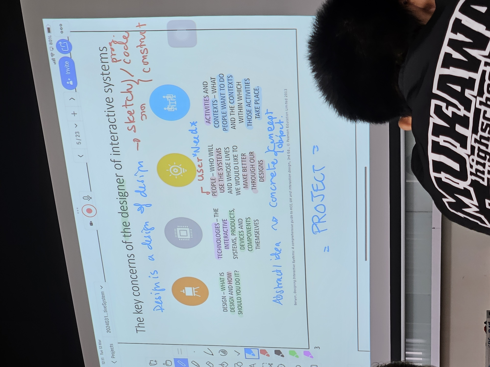

date: 
time: 09:47
---
- exhibition design books

- brainstorm's result presentation

- record some of my ideas

- keyconcepts

- working with microcontroller: must read datasheet
- Exhibition Designer in big Exhibitions like expo usually start from Map (place in bird eye view)
- Pavilion - sala in thai spelling
	- ppl like to keep beautiful pavilions
- design big exhibition usually used large amount of time to design
	- Expo takes 10 years in advance

- Exhibition breakdown
	- Lightning/LED
		- Light box - projection
	- Object - ex. 4D - sense: scent smell
	- perspective
	- interactivity
	- activity and engagement

- for me, UK seedbank Expo look likes Sandworm in DUNE
- Milan, UK research center in bermingham, Exhibition
	- IOT collect data: number of every bees in the city
- German and japanese pavilion usually showoff cool techs

- Metamessage : message behind the message
