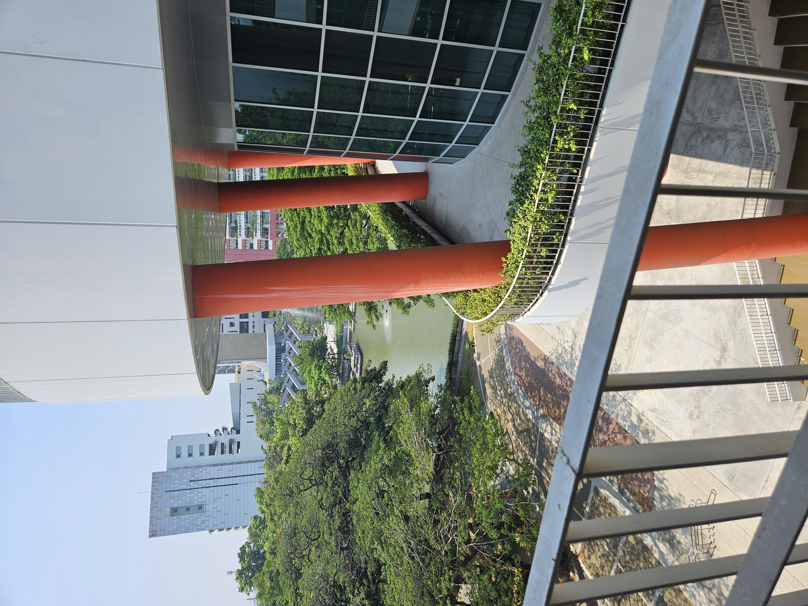
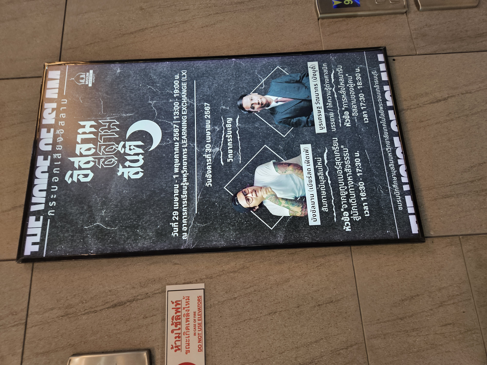
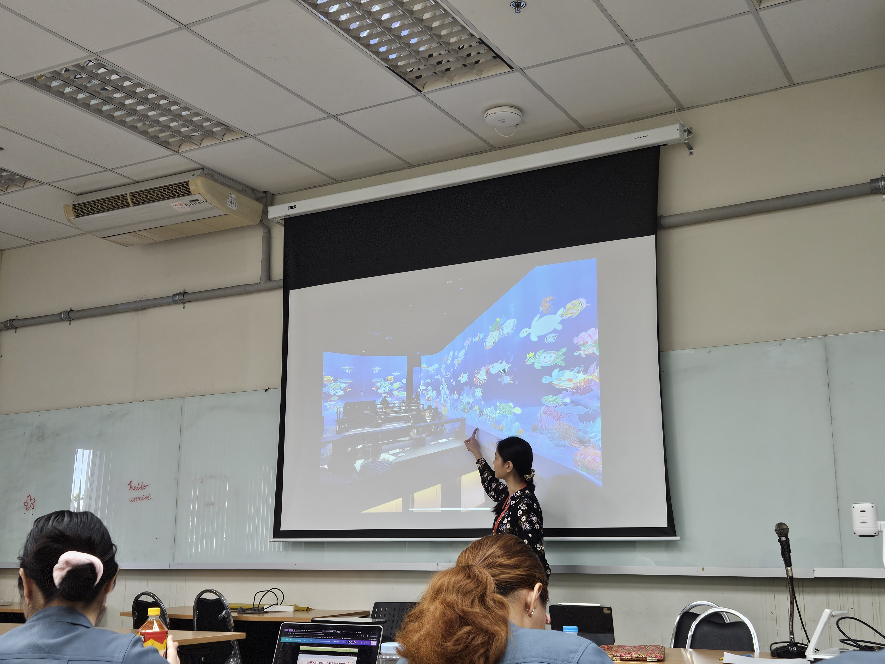
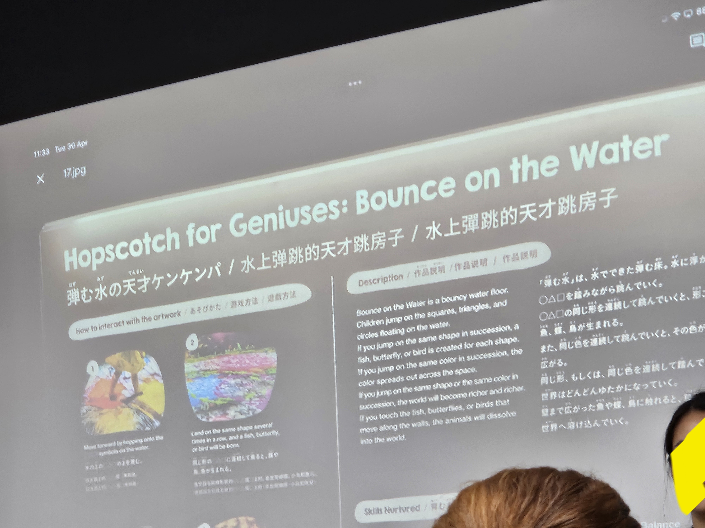

### Human mobility data 
วันนี้อาจารย์ piyanit รับหน้าที่เป็นผู้สอนหลัก โดยอ.จะสอนเกี่ยวกับการใช้ sensors และเทคโนโลยีต่าง ๆ ในการเก็บข้อมูลเกี่ยวกับผู้ใช้.  

วันนี้ผมเข้าคาบช้าพอสมควร มาถึก็เริ่มต้นที่เราสามารถใช้ wifi router ในการเก็บข้อมูลว่ามีคน หรือ device ปรากฎในพื้นที่ตอนไหน/ออกจากพื้นที่ตอนไหนได้ และถ้ามีมากกว่า 1 เครื่อง ซึ่งก็คืออย่างน้อย 2 เครื่อง เราจะสามารถคำนวณตำแหน่งของผู้ใช้ได้

วิธีการคำนวณ แอบดูคล้ายการคำนณระยะของดวงดาวในระบบสุริยะแปลก ๆ 

ทางอาจารย์ได้เล่าเรื่องอุปกรณ์ beacon ที่ใช้ในการตรวจจ้บบุคคล ซึ่งก็มี project นึงที่ esic lab และ sky มีส่วนร่วมในการติดตั้ง beacon จำนวนมหาศาลที่สนามบิน

### ห้องกระจกลับแล
ทีนี้อ.ทั้ง 2 ท่านก็พาพวกเราไปดูสถานที่ candidate ที่ตึก LX 
ซึ่งเราเล็งชั้น 1 หรือชั้น 3 ไว้จากการประชุมเมื่อคืนก่อน

น่าเสียดายที่เราไม่สามารถติดตั้งตัวงานที่ชั้น 3ได้ เพราะมันดันอยู่ใกล้กับห้องประชุม และทางผู้ดูแลสถานที่ก็กังวลเรื่องเสียงจะไปรบกวน

เหลือห้องบนชั้น 4 ที่เราสามารถยืมได้ องค์ประกอบต่าง ๆ ก็ทัดเทียมกับห้องชั้น 3 แต่การเดินทางดูยากลำบากกว่ามากพอสมควรเลยแฮะ อยู่ห่างกันชั้นเดียวจริงดิ 

ภาพวิวที่ถ่ายเล่น ๆ แถวชั้น 2~4

พอได้ห้อง พวกเราก็มาออกัน นั่งจินตนาการถึง sitting ที่เป็นไปได้, การจัดวาง props, ความจุคน การจัดเรียงสายไฟ แล้วก็พากันกลับห้อง

ภาพที่ถ่ายเก็บไว้ เพราะไม่ค่อยได้เห็นงาน talkshow แนว ๆ นี้บ่อย

### อาจารย์มหาวิทยาลัยเราเดินบนน้ำได้

อาจารย์ได้เปิด video นิทรรศการที่อ.เคยไปที่ญี่ปุ่นให้ดู (Hopscotch for Geniuses: Bounce on the water) ที่ปล่อยให้ผู้ชมกระโดดเล่นไปกับ interactive floor ได้ 

หลาย ๆ อย่างที่อ. เปิดให้ชมวันนั้นดู responsive มาก ๆ เบื้องหลังอาจไม่ได้ใช้แค่คอมจิ๋ว ๆ ธรรมดา ๆ

