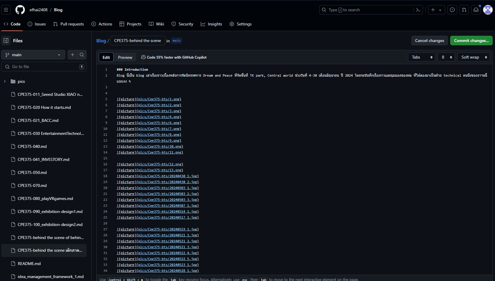

### introduction
สาเหตุที่ผมเขียนบล็อกนี้ เริ่มต้นจากแนวคิดหลักว่ามันคงน่าสนุกดี ที่มาเขียน Behind the scene of Behind the scene เหมือน ฟังก์ชันประเภทเรียกตัวเอง 
แนวคิดหลักที่ 2 คือผมอยากบันทึก ระเบียบวิธี การเขียนของผมไว้ บทความนี้เป็นบทความตั้งไข่ ไม่ได้ถูก เขียนโดยอ้างอิงจาก ทฤษฎีเกี่ยวกับการสื่อสารให้ได้ใจความ หรือการเขียน Content แบบ Ted Talk แต่ในอนาคตผมก็คาดหวังที่จะศึกษาเกี่ยวกับเรื่องพวกนั้น เพื่อพัฒนาทักษะการสื่อสารผ่านการเขียนของผม
ถ้าผมได้ Inside บางอย่าง จากการทดลองเขียนบทความนี้ ก็อาจเป็นประโยชน์ต่อผมในอนาคตในการสร้างกลวิธีการเขียนของตัวเอง ในแบบที่ refine ขึ้น

### เครื่องมือที่ใช้
หมายเหตุ: ผมชอบการพิมพ์ด้วย แป้นพิมพ์คอมพิวเตอร์ แต่มีปัญหาบางอย่างที่ทำให้ผมไม่สามารถพิมพ์ภาษาไทย ด้วยเป็นพิมพ์ที่ใช้กับคอมพิวเตอร์ในขณะนี้ได้ เวลาพิมพ์ภาษาไทยต้องพิมพ์ด้วยมือถือไปก่อน

- ระบบ speech-to-text
(พิมพ์ตัวอักษรเป็นพันคำด้วยการใช้แป้นพิมพ์โทรศัพท์มือถือเพียงอย่างเดียว มันอาจจะเกินมนุษย์ไปหน่อย)

- โทรศัพท์มือถือ

- ไอแพด

### วัตถุดิบ
- บันทึกประจำวันจากแอพจดโน๊ต ที่พักหลังไม่ค่อยได้จด

- ภาพถ่ายในมือถือที่มี metadata เป็น เวลาที่ถ่าย หรือแคปเจอร์

- Chat log ใน discord

- กลุ่ม facebook ของ course เรียน

### ขั้นตอน 
#### 1. ขุดค้น รื้อฟื้น ที่ผ่านมาเกิดอะไรขึ้นบ้างนะ
ผมค้นพบว่าการค่อยๆ ขุดค้น รื้อฟื้นไทม์ไลน์
แบบเป็น Layers ก็คือค่อยๆ ขูดค้นจากวัตถุดิบทีละอย่าง จะลดความสับสนได้มากกว่า 

ผมเริ่มจากการขุดค้นไทม์ไทม์ไลน์ ด้วยกำหนดการต่างๆ ในกลุ่มเฟซบุ๊กก่อน แล้วค่อยขยับไป เป็น holistic view วันหรือกำหนดการสำคัญ และค่อย narrow down ด้วยการย้อนดูรูปภาพของวันต่างๆ ว่ามันเกิดอะไรขึ้นระหว่างทาง แล้วคอยย้อนไปดูประวัติการพูดคุยสนทนาในกลุ่มดิสคอร์ด
ในรายละเอียดที่เฉพาะเจาะจงมาก อย่างตอนนั้นแนะ ระหว่าง ผมและเพื่อนๆ กลุ่มฝ่ายเทคนิค ในการไปซื้อของ อาจจะมีการย้อนดู
ในรายละเอียดที่เฉพาะเจาะจงมาก อย่างตอนนัดแนะ ระหว่าง ผมและเพื่อนๆ กลุ่มฝ่ายเทคนิค ในการไปซื้อของ อาจจะมีการย้อนดู
 แชทในเฟซบุ๊ก เพื่อ recall รายละเอียดเล็ก ๆ น้อย ๆ ที่น่าจะทำให้บทความลื่นไหลขึ้น

### 2. การร่างภาพรวม 
เริ่มต้นจาก สิ่งที่เกิด และผลลัพธ์ของเหตุการณ์ก่อน แล้วค่อยเต็มภาพรวม หรือรายละเอียดทีหลัง

จัดหน้าหัวข้อหลัก หัวข้อรอง ด้วย markdown format ในโปรแกรม obsidian

เขียนจนพอใจแล้วค่อยย้ายไปลงไป github ก่อนจะตั้งสถานะของโน้ตใน โปรแกรม obsidian เป็น archived

### 3. Seasoning with pictures 

