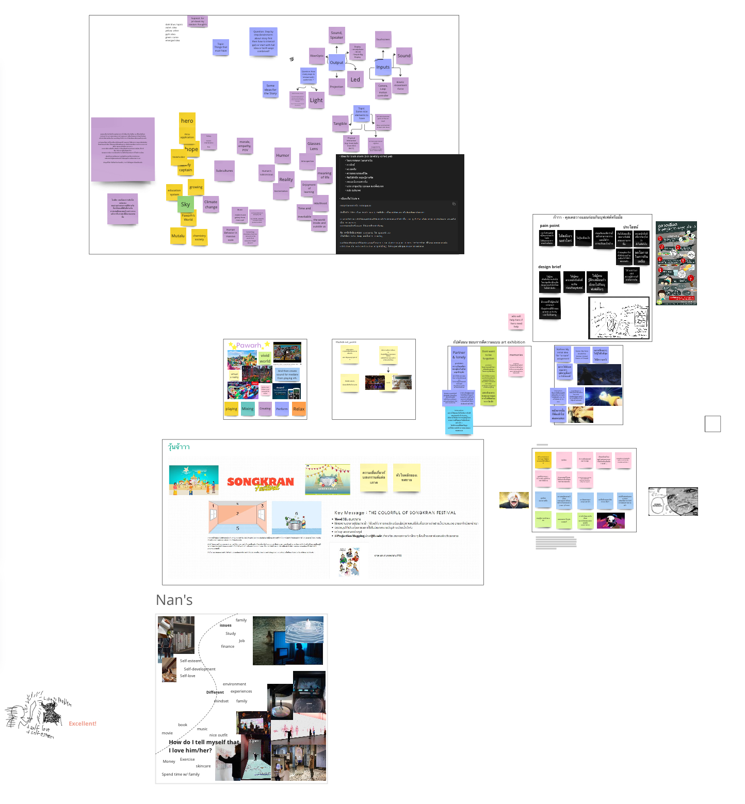

### Introduction
Blog นี้เป็น blog เล่าเรื่องราวเบื้องหลังการจัดนิทรรศการ Dream and Peace ที่จัดขึ้นที่ TK park, Central world ช่วงวันที่ 4-30 เดือนมิถุนายน ปี 2024 โดยจะบันทึกเรื่องราวและมุมมองของผม ที่ได้ลองมาเป็นฝ่าย technical คนนึงของงาานนี้แบบงง ๆ 

### recap ที่มาที่ไปแบบเร็ว ๆ 

การจัดนิทรรศการนี้ เป็นส่วนหนึ่ง และส่วนสำคัญของวิชา Interactive Computing ของที่บางมด ในแต่ละชั้นปีก็จะมีรหัสวิชาแตกต่างกันไป อย่าง ของปี 3 ก็จะเป็น CPE364, สำหรับปี 4 อย่างผมก็จะเป็น CPE375

ผมเลือกลงเรียนวิชานี้เพราะหวังอยากศึกษาแนวทางในการเอาความรู้ฝั่ง tech (ที่อยากมี) มา contribute ฝั่งศิลปะบ้าง เผื่อเห็นความเป็นไปได้ใหม่ ๆ ในการทำ project ต่าง ๆ ในอนาคต, อยากรู้ mindset ที่จำเป็นในการพัฒนาเทคโนโลยีฝั่งที่น่าจะคาบเกี่ยวกับ HCI นอกจากนั้นก็อยากลองลงมือทำ จัดนิทรรศการของตัวเองและเพื่อน ๆ ดู มันน่าสนุกดี 555 

ช่วงแรก ๆ ของ course จะเป็นการเรียนรู้เรื่องแนวคิด, tools ที่เกี่ยวข้องกับการ design ตัว interactive exhibition ซึ่งมีทั้งการเรียนรู้แบบทฤษฎี พร้อมตัวอย่างจากนิทรรศการว้าว ๆ จากทั่วโลก และการเรียนรู้ผ่านการลุยสถานที่จริง เขียน blog ซึ่งเป็นทางหนึ่งในการ interact กับสิ่งที่เราได้รับรู้เช่นกัน 

พอเริ่มเรียนไปได้ซักพัก อ.ก็ให้แบ่งกลุ่มระหว่างเด็กภาคปกและอินเตอร์ แล้วการนัดแนะ brainstorming ก็เริ่มต้นขึ้น
### Brainstorming
งานนี้เริ่มต้นจากการระดมสมอง ทุกคนแชร์ แบ่งปันไอเดียที่แต่ละคนมี ว่าอยากทำเรื่องอะไรบ้าง เริ่มแรกเดิมทีทางผมคิดไว้ว่าจะ brain dump เสนอ fragment of ideas ที่จะค่อยเอาไป interact หรือ contribute กับไอเดียคนอื่น จน story ค่อย ๆ emerge ขึ้นมา เลยจัดวางไอเดียแต่ละเรื่องไว้โดยไม่มีเรื่องไหนเป็นเอกเทศ
### The great filter 
Great Filter คือทฤษฎีที่กล่าวถึงปรากฎการณ์บางอย่างในจักรวาล ที่ทำหน้าที่เหมือน filter ในการหยุดยั้งการดำรงอยู่ของสิ่งมีชีวิตในเอกภพ นำไปสู่การสูญพันธุ์ นำมาซึ่งประเด็นคำถามว่าเผ่าพันธุสิ่งมีชีวิตในโลกมนุษย์นั้นก้าวข้ามพ้น Great filter แล้วหรือยัง

เนื่องด้วยความกระชั้นชิด กำหนดการสอบของสมาชิกส่วนใหญ่ในกลุ่มที่เกือบชนกับเวลาที่กำลังประชุมอยู่อย่างพอดิบพอดี บีบให้เวลาประชุมมีอยู่อย่างจำกัด ทำให้คนในกลุ่มเสนอการ vote หา story ที่จะนำมาเป็นแกนหลัก เพื่อให้ได้ข้อสรุปก่อนหมดเวลาประชุมได้

พวกเราได้ story ที่จะนำมาเป็นแก่นหลัก เป็น story ที่ผสมระหว่างสมาชิก 2 ท่าน การ interact กับเสียง และการจรรโลงใจ หลีกหนีจากความวุ่นวาย 

ผมเองก็ vote ไอเดียนี้เช่นกัน เพราะตอนนั้นผมมองว่า story นี้มีแก่นหลักเป็น“output option” (เลือกที่จะเน้นการ output เป็นเสียงเพลง) ที่ดูเป็นปลายเปิด เหมาะกับการ develop หาไอเดียอื่นมา on-top ผมในภายหลังก็แอบตำหนิตัวเองว่าตอนนั้นตัวผมไม่ได้เลือกด้วยเหตุผลที่เอา story หรือสิ่งที่ต้องการจะสื่อสารเป็นเกณฑ์ โดยกระโดดข้าม step, jump to the conclusion ไปมองที่วิธีการเป็นหลักก่อน ก็ทำให้คิดกับตัวเองว่าในอนาคตคงต้องทดลองฝีกมองโดยเริ่มจาก story ให้เป็นนิสัยดู ในสถานการณ์ที่เวลามากพอ

### นำเสนอ ปลายเดือนเมษา 

วันที่ 23 เมษา ตอนนั้นธีมของ story ของกลุ่มเราเริ่มเป็นรูปเป็นร่าง ว่าอยากทำเป็นธีมแนวห้องสมุดที่มีต้นไม้อยู่ตรงกลาง สร้างบรรยากาศด้วยเสียงเพลงแนว Ambient, เน้นให้ผู้ชมรู้สึกผ่อนคลาย 

พวกเราก็ได้นำเสนอไอเดีย story ของกลุ่มเรา ได้รับ feedback กลับมาว่ากลุ่มเราเน้นใช้ simple technology ในการ implement(ข้อดี) ทั้งกลุ่ม 1 และกลุ่ม 2(พวกเรา)ก็จะมีจุดแข็ง และจุดที่ควรไปวิเคราะห์เพิ่มต่างกัน

### ประชุมแบบ speedrun และหัวหน้าแผนกจำเป็น
วันที่ 27 เดือน 4 มีการประชุมเกิดขึ้น เพื่อหาไอเดีย เคาะเรื่องชื่องาน สถานที่จัด อะไรแบบคร่าว ๆ และแบ่งหน้าที่ว่าใครจะรับหน้าที่รับผิดชอบส่วนไหน 

สำหรับชื่อนิทรรศการ เราได้ชื่อเป็น mute the confusion และสำหรับสถานที่ พวกเรามีความเห็นว่าที่ vote ๆ กันมาจะเอามาเป็น candidates ไปก่อน 

ผม และเพื่อนอีก 2 คน รุ่นน้องอีก 1 เลือกที่จะเป็นทีม technical และผมก็ถูก vote ให้เป็นหัวหน้าทีม technical แบบงง ๆ 
### candidate ห้องกระจกลับแล  
อาจารย์ให้ guideline ว่าเราควรหาและเลือกห้องสำหรับจัดแสดงผลงาน ที่เหมาะสมกับ story และสถานการณ์ ซึ่งจากการประชุมคราวก่อน เราได้เล็ง candidates ไว้ประมาณ 3 ที่ เช่น ห้องในตึก LX, ชั้นแรกของห้องสมุด

​มีสมาชิกบางท่านอาสาไปช่วยกันถ่ายรูปห้องที่เล็งไว้ ในตึก LX ชั้น 3

หลังจากนั้น ในวันที่ 30 เมษายน ก็เป็นวันที่อ.พาเดินขัามตึกไป LX เพื่อลองดูสถานที่จริง 

ตึกชั้นแรกถูกจองระยะยาว นอกจากนี้ยังไม่สามารถใช้ห้องประชุมตู้กระจกของชั้น 3 ได้ เพราะห้องข้าง ๆ เป็นห้องประชุม 

ทำให้เหลือห้องประชุมตู้กระจกของชั้น 4 ทางผมมองว่าการตั้งไว้บนชั้น 4 นั้นมีทั้งข้อดีและเสีย
- ข้อดี
	- ขนาดพอเหมาะ ไม่ใหญ่หรือเล็กไป จุคนได้ประมาณ 10 คน
- ข้อเสีย
	- เดิยทางมายังชั้น 4 ลำบาก
	- ต้องบุผนังเพื่อกั้นแสงเอง
 ในตอนท้ายคาบ อ.ก็สั่งงานกิจกรรมให้คนในกลุ่มช่วยกันเขียนแผนภาพ CANVAS เพื่อเพิ่ม insights เกี่ยวกับผู้ที่มีแนวโน้มจะเยี่ยมชมงาน

พวกเราได้ถามถึง deadline ที่ควรเสร็จของงานนี้ ท้ายคาบ อ. เลยสรุป deadline ที่ควรจะเป็นของกำหนดการต่าง ๆ ไว้ โดยทุกอย่างควรเสร็จสิ้นในช่วงก่อนวันที่ 29 เดือน 5 เพราะเหล่าปี 4 ก็จะไม่ว่างเพราะมีสอบ senior project และชั้นปีอื่น ๆ ก็คงเริ่มสอบเสร็จกัน ห้องสมุดหรือสถานที่ต่าง ๆ ก็จะเริ่มว่าง ไม่มีใครมาดูงานของพวกเรา
### ​technical team สำรวจของ (for the fist time) 

นัดกับปั้น ทัวร์ชมห้อง esic เพื่อหาอุปกรณ์ไปทดสอบ 

ยืม LED strip จากห้อง ESIC ไปก่อน และบุกห้องเก็บของของภาค เพื่อดูว่ามีอะไรที่เราหยิบยืมไปใช้ได้บ้าง ที่นอกเรื่องแต่ว้าวคือเจอ thinkpad รุ่นเก่า ๆ กับ iphone รุ่นแรกด้วย 

แล้วเราก็ยืม LED 5mm แบบไร้สีจากห้อง lab ไฟฟ้า (ที่ไม่เคยเข้ามาก่อน) โดยรวมวันนี้ก็สนุกดี ได้ทิ้งท้ายก่อนเรียนจบมหาลัยด้วยการลองไปเยี่ยมชมหลาย ๆ ห้องที่ไม่เคยเข้ามาก่อนเพราะ covid-19 กับการเรียนช่วงปีแรก ๆ ที่ต่างวิทยาเขต
### ประชุม on-site หลังจบคาบ again 
คลาสของวันที่ 7 เดือน 5 สอนโดยอาจารย์ piyanit โดยเน้นไปที่เรื่อง human mobility data, การเก็บข้อมูลเกี่ยวกับผู้เยี่ยมชมด้วยการใช้ wifi และ beacon 
### อยากเที่ยวห้างงง
อ.เสนอ TK park เป็น candidate สถานที่เพิ่มอีก 1 สถานที่ นอกจากต้องเดินทางไกลหน่อย ก็มีข้อได้เปรียบหลายข้อ เช่น เราไม่ต้องห่วงเรื่องจะไม่มีคนดูถ้าพ้นช่วงเวลาสอบของม.เรา, เราได้มีโอกาสเข้าถึง audience มากขึ้น และการได้ลองจัดอะไรแบบนี้ในห้างใหญ่ ๆ ก็เป็นสิ่งที่ผมอยากลองลุยดูซักตั้ง ถ้ามีโอกาส แถมวาดฝันไว้ว่าคงได้มีโอกาสไป shopping อีก แจ่ม

มีการ vote ด้วย lazy consensus ได้มติเอกฉันฑ์ว่าไม่มีใครคัดค้านการจัดที่นั่น แล้วอาทิตย์หน้าเราจะลองไปดูสถานที่จริงกัน ประเด็นถัดมาคือจะจัดรวมกันระหว่าง 2 group หรือจะจัดแยก 

 
 หลังจบคาบ ทุกคนในกลุ่มก็มาประชุมกันว่าจะเอายังไงกันดี ทางผมก็ได้ proposed เกี่ยวกับ input-output นิดหน่อย ว่าในภาพรวม ระบบมันเชื่อมโยงกันประมาณยังไง(ภาพซ้าย) กับเราควรจะให้มีเสียงที่จุดไหนบ้าง (นิดหน่อยในภาพขวา)
### นอนหลับในห้องเก็บเสียง (14 พฤ)

วันที่ 14 พวกเราได้มาเรียนนอกสถานที่ที่ TK park ใน central world วันนั้นก็มีผม, กัปตันที่ในตอนนั้นก็อยู่ในสภาพใกล้ตายหลังเพิ่งผ่านวันนำเสนอ poster/ปัจฉิม ประจำวัน project day ไปเมื่อวันที่ 13 หมาดๆ และน้อง ๆ อีก 2 ชีวิตก็เหมา taxi เดินทางจากหน้าม. ตั้งแต่ช่วง 8.30 น. ไปถึง central world ช่วง 9 โมงกว่า ก็ไปหาอะไรแถวนั้นรองท้องก่อนไปรวมตัวกันที่ชั้น 7 ของ central world ช่วง 10 โมงเช้า  

 
 เริ่มแรก อ. ก็จะนัดแนะเกี่ยวกับสถานที่, remind เรื่อง design thinking และ process STEP สำหรับ interactive experience, wrap up เรื่อง design brief ของทั้ง 2 กลุ่มและตัวงานของเรา ก่อนจะปล่อยให้พวกเราระดมสมอง คุยกัน และคลุกคลีกับตัวสถานที่

ตอนนั้นเราก็เน้นเก็บข้อมูลเกี่ยวกับตัวสถานที่ไปก่อน ได้ความว่าห้องกว้างประมาณ 4m, ยาว 6m ผนังบุด้วยแผ่นเก็บเสียง ด้านบนมีหลอดไฟ studio 

ในกลุ่มก็มีการ discuss กันถึงการจัดวางสิ่งของในห้อง ตอนนั้นผมเสนอเรื่อง projection mapping ไป แบบที่มีคนจัดนิทรรศการแบบ interactive wall แต่หลาย ๆ คนในกลุ่มกังวลเรื่องตำแหน่งการวาง projector, ระยะ, การมีคนบังแสง, การมีคนมากระแทก และพวกเราทั้งกลุ่มตอนนั้น ยังไม่รู้ know how ว่ามันยากหรือง่ายกว่าการสร้างภาพด้วย LED เลยพับไอเดียเก็บไปก่อน 

หลังจากเก็บข้อมูลสถานที่จนพอใจ ก็แยกย้ายกันไปทานอาหาร/กลับม. วันนั้นได้ลองทานแปะก๊วยคั่วเกลือ ก็ขม ๆ แปลก ๆ ดี
###  technical team assemble 

ผมและเพื่อน ๆ ฝ่าย technical ของกลุ่มได้นัดแนะว่าวันที่ 17 จะมาเก็บวัสดุ อุปกรณ์สำหรับมาทดลอง implement ตัวงาน เก็บกวาดให้มาก ๆ เข้าไว้ ตอนคุ้ยหาของในห้อง ESIC Lab กัปตันก็เจอ interactive wall kit ซึ่งพอลองไปหาในเน็ต ก็พบว่าเป็นชุด sensor, MCU สำหรับทำ interactive wall ด้วย touch sensor หรือสื่อกลางอื่น ๆ โดยเฉพาะ พอลองหาข้อมูลใน website เพิ่มคร่าว ๆ ก็พบว่าหนทางการทำ projection mapping อาจไม่ยากกว่าที่คิดก็ได้ 

วันนั้นแต่ละคนก็ลองทดลองใช้งานอุปกรณ์ที่ตัวเองได้มา เพื่อนคนนึงก็ลองใช้ตัว board สำหรับ interactive wall, อีกคนก็ลองคุมไฟ LED ที่เชื่อมกับ Arduino UNO R3 ด้วย PC terminal  ส่วนผมก็ลองคุมไฟกระพริบด้วย seeed studio xiao ble ที่ติดกระเป๋าจาก senior project ดู แต่ตอนนั้นยังไม่เกิดผล
### projection mapping might not that hard

หลังจากวันนั้น ก็มีเพื่อนในกลุ่มบางคนที่เริ่มมองการใช้ projection mapping เป็นตัวเลือกหนึ่งที่เป็นไปได้ กรณีไม่ต้องการเจาะ LED โดยมีตัวอย่างจาก https://www.playmodes.com/home/picasso-1936/ 

กับทางผมเอง พอเห็นตัวอย่างการใช้ tools อย่าง MadMapper ควบคู่กับ Interactive wall kit ที่กัปตันหาเจอ ตัวเลือกการใช้ projection mapping เลยดู appealing ขึ้นมา
### ประชุมท่ามกลางสายฝน 

 
 วันที่ 19 เป็นอีกวันที่พวกเรานัดประชุมกัน โดยเน้นคุยกันว่าควรใส่อะไรเข้าไปในตัวงาน มีองค์ประกอบอะไรบ้าง

ประเด็นหลักที่มีการ discuss กันคือเรื่องธีมสี 
### 21 modular is a key

วันที่ 21 ผม เพื่อนและรุ่นน้องอีกคน เป็นตัวแทนของกลุ่มผมในการไปคุยกับพี่บุ๊คและพี่หมอน โดยมี agenda หลักเป็นวางแผนการประสานงานกับโรงงาน ในกรณีที่มีของที่ต้อง customize สั่งทำเป็นพิเศษ โดยพวกพี่ ๆ เขาจะช่วยจัดการให้ และ design ของกลุ่มเรา 

 
 ตัวงานที่วางแผนกันในกลุ่มไว้แบบแรก จะเป็นกำแพงไม้ ที่จะมีการเจาะรูสำหรับฝัง sensor และให้ทีมจัดซื้อจัดวาง ละเลงวาดภาพลงไปที่ไม้ ทางพวกพี่ ๆ ก็ได้เล่าถึงข้อจำกัด ว่าถ้าให้โรงงานทำตัวผนังให้ แล้วส่งมาที่ม.ให้พวกผมละเลง แล้วค่อยส่งต่อไปที่ central world งบประมาณในการส่งของจะบานปลาย ในขณะที่ถ้าให้ผลิตแล้วส่งไปที่ central world เลย ก็อาจจะต้องบรีฟภาพที่วาดให้เสร็จในเร็ว ๆ นี้ ซึ่งกระชั้นชิดพอสมควร หรือคนในทีมอาจต้องไปละเลงวาดภาพที่โรงงาน ก็จะดูยุ่งยาก

คุยไปซักพัก ผมก็นึก solution รูปแบบนึงออกพร้อม ๆ กับที่พี่กำลังจะนำเสนอพอดี ว่าเราน่าแบ่งส่วนระหว่างส่วนกำแพงที่เป็นโครงรับน้ำหนัก และส่วน art+sensor ออกจากกัน 

 
 โดยอาจารย์หมอนก็เปิด video Digital Interactive Board at Creaverse ประกอบเป็นตัวอย่าง 

การทำชิ้นส่วนให้เป็น modular แบบนี้นั้นง่ายต่อการซ่อมบำรุง เพราะในการจัดแสดง ใช้งายไปเรื่อย ๆ arduino หรือ sensor อาจพัง ถ้าทำ modular แบบนี้ เวลาพังก็สามารถถอด, replace ได้เลย

ตอนนี้เราได้ design ใหม่เป็นแนว ๆ รูปแขวนติดกำแพงหลาย ๆ รูป ที่จะวาดแยกแล้วค่อยไป assemble ในงาน

แต่พี่ ๆ ก็เสนอแนะว่าตัวงานเป็นเน้นไปที่กำแพง มันอาจดู obvious ไป อยากเพิ่มการ interaction บางอย่างที่ผู้ชมบังเอิญพบได้ผ่านพฤติกรรมของเจ้าตัว อย่าง นั่ง แล้ว interact กับ props (ไอเดียแรก ๆ)

อีกเรื่องที่มีการพูดคุยและต้องเน้น คือ specification ของ projector โดยเราต้องศึกษาว่า projector เป็นแบบ short throw หรือ long throw มี ratio, แสง อะไรเท่าไร
### ติดต่อยืมจอ/projector(again)
หลังจากประชุมกับพี่บุ๊ค พี่หมอนเสร็จ เราก็ไปตามเช่าอุปกรณ์ต่อ
ขอเช่า projector จากพี่เม้ง โดยผมเอากลับบ้าน นอกจากนี้ก็มีเซ็นยืมจอขนาด 50 นิ้วจากห้องประชุม ถ่ายไว้ก่อน
ทุกอย่างที่ยืม ถูกเซ็นในชื่อของรุ่นน้อง เลยต้องรักษาดี ๆ  
### แสงสีฟ้าต้องใช้ Ophtus 
วันที่ 22 ผมได้ลองทดสอบ projector ที่ได้มาในห้อง ลองวัดหยาบ ๆ ถึงขนาดแบบฉายเต็มที่ในระยะ 4m และทดลองเพิ่มระยะ ด้วยวิธีใช้กระจกเงาช่วย จากที่เห็นในเน็ต 

- หลังจากนี้ design จะเปลี่ยนเรื่อย ๆ ระดับวันต่อวัน 
### นำเสนอพี่บุ๊ค
วันที่ 23 may เป็นวันที่ฝ่าย จัดวางจัดแสดง งั้นมาคุยกัน โดยผมก็จะไปอัพเดทรีแคมป์ และ เอาโปรเจ็กเตอร์ไปให้ทุกคนลองใช้และวัดขนาดที่แท้จริง 

 
 เพื่อนอีกคนที่เป็นฝ่ายเทคนิค ก็ได้ประสานงานกับรุ่นน้อง ในการเขียนเว็บ

 
 จากการคุยกันวันนี้ ก็ได้เกิดเป็นเกิดดราฟใหม่ เปลี่ยนจากการ interact กับกำแพง เป็น interact กับช่องต่าง ๆ ในตู้หนังสือด้วย distance sensor แทน ลดบทบาท projector/projection mapping ลง เหลือซัก 40% แล้วไปเน้นการ interaction with props/sensors ในแต่ละช่อง โดยตู้หนังสือจะซื้อจากอิเกีย เพื่อที่จะได้ไม่ต้องทำการสั่งซื้อ
### ก้าวแรกกับ distance sensor  

วันที่ 24 ลองใช้ Arduino Nano ต่อกับตัว distamce sensor ส่งสัญญาณไปยัง PC ตาม tutorial ปราฎว่าใช้งานได้ปรกติ 

ตั้งแต่วันที่ 24 เป็นต้นไป ก็จะมีการนัดแนะ พูดคุยในกลุ่มแบบวันต่อวัน
### ไป IKEA ครั้งแรก กับการตามล่าสาย HDMI ยาว 7m 

วันที่ 28 เพื่อน กับรุ่นน้องอีกหนึ่งคน อาสาไปติดต่อ สั่งซื้อ ตู้หนังสือจากอีเกีย ให้ไปส่งที่บ้านของรุ่นน้องฝ่ายจัดวางคนหนึ่ง  การสั่งซื้อเป็นไปได้ด้วยดี

แล้วเราก็เดินทางไปซื้อสาย HDMI ที่ห้างใกล้ๆ แต่ก็ไม่พบสาย HDMI ในขนาดที่พวกเราต้องการ
### ตามล่าสายหลังขายวิญญาณ เติมเต็มจิตวิญญาณด้วยยำใบชา  
คืนวันที่ 28 ถึงวันที่ 29 เป็นวันที่ทางผมและเพื่อนฝ่าย technical อีกคนที่ทำ project ด้วยกันแทบไม่ได้นอน จากการลุยงาน senior project วันที่ 30 ผมและเพื่อนคนนั้นก็ตกลงไปหาซื้อสาย HDMI ต่อที่บ้านหม้อ เราเจอสายที่ต้องการในเวลาไม่นาน ขอใบกำกับภาษีในนามมหาวิทยาลัย สำหรับส่งให้รุ่นน้องที่มีหน้าที่รวบรวม เป็นอันเสร็จงานหลักของวันนี้ 

ก่อนกลับก็พาเพื่อนแวะร้านอาหารพม่า ทุกคนชอบยำใบชาแบบเอกฉันฑ์

กลับหอก็กลับไป test ตัวสาย ใช้งานได้ปรกติดี ตกดึกก็ลุยต่อวงจรต่อ ทำตัวคุมเสียงด้วย 2 sensors ต่อกับ Arduino Nano สื่อสารไปยัง PC เสร็จราว ๆ ตี 3 

ทั้งงานนี้และงาน senior project ที่ขนาบข้างช่วงนี้ ช่วยย้ำเตือนผมถึงความสำคัญของ time management ได้ดี ว่าถ้าผม manage งานตัวเองไม่ดีตั้งแต่เนิ่น ๆ ก็จะเละแบบนี้ 555
### อารัมภบท  

วันที่ 31 ตามกำหนดการคือวันแรกของการไปติดตั้งอุปกรณ์นอกสถานที่ จากที่เมื่อคืนแทบไม่ได้นอน เลยติดต่อในกลุ่มขอแยกเดินทางไป late หน่อย ทางผมเลยเดินทางไปโดยมีเป้าหมายหลัก เป็นการส่งมอบ projector ให้ฝั่งพัฒนา webUI และ มาดู sitting ของงานที่จัด หาแนวทางติด sensors และจัดวาง PC ให้ต่อกับลำโพงได้

ตอนนี้มี task คือภายในวันพรุ่งนี้ sensors ทั้ง 8 อันจะต้องสั่งการตัว PC ได้ เลยนัดแนะกับทีม technical ฝั่งจัดการเรื่องเสียง ว่าจะมาต่อวงจรส่วนโครงให้สามารถ function ได้ เตรียมการเรื่องความยาวสายให้ถึง

ทางรุ่นน้องให้ความช่วยเหลือด้วบการติดต่อเพื่อนของรุ่นน้องให้ช่วยเปิดห้องให้

ตอนกลับถึง ม. ฝนดันตก เลยซื้อของ 7-11 มานั่งกิน ก่อนขึ้นตึก ม. ไปต่อวงจร ทดลองบัตรกรี บรีฟโครงสร้างของวงจรกับคนในทีมรวม 3 คน 

 
 นอกจากนี้ก็มี task เอาของที่ฝ่ายจัดวางฝากไว้ให้ผมเอามาวันพน. ในห้อง ESIC, ตู้ชั้น 11 (ที่จริงทางนั้นฝากผมนานแล้ว แต่ผมลืม 555)

หลังต่อวงจรส่วนโครงเสร็จ ฝนซา ก็แยกย้ายกันกลับหอไปนอนเอาแรง
### เนรมิตรกระต๊อบใน 2 คืน(1)

วันที่ 1 เป็นวันที่ผมและเพื่อนฝ่ายจัดวาง sensor เริ่มทำการติดตั้ง sensor กับชั้นหนังสือ ต่อสาย jumper ไปยัง arduino และต่อไปยัง PC แต่ก่อนที่จะได้ทำทุกอย่างแบบเต็ม stream ผมและเพื่อนร่วมชะตาของผมก็จะต้องผ่านการสอบไปให้ได้ก่อน
### ห้องเย็น ที่ไม่เย็นแค่สำหรับนักเรียน 
การสอบของวิชานี้เป็นแบบ oral test และสอบแบบข้อเขียน ที่จะสอบในวันพรุ่งนี้ นักเรียนจะถูกเรียกตัวไปสอบทีละ 3 คน รอบที่ผมโดนเรียกสอบเป็นกลุ่มเด็กปี 4 ล้วน 
ก่อนหน้านั้นพวกผมก็ไปทานอาหารกลางวันที่ pepperlunch กันด้วยงบเบิกของ อ.
พอมาถึงคิวพวกผมหลังอาหาร สิ่งแรกที่นึกออกคือห้องนี้แม่xเย็นชิxหายเลย และไม่ใช่แค่ผมและเพื่อน ๆ ที่คิดแบบนั้น อาจารย์ก็บ่นเหมือนกัน หนาวแท้ 
พวกผมสอบโดยต่างคนต่างลองคิด ใช้มุมมองที่แตกต่างกัน ต่างคนต่างตอบด้วยมุมมองที่คิดว่าน่าจะเป็นแก่นของวิชา จากการ reflect จากเนื้อหาต่าง ๆ ที่ผ่านมา ซึ่งด้วยโชคหรืออะไรก็ตามแต่ พอต่างคนต่าง improvise หรือตอบคำถาม ในมุมมองของแต่ละคน เวลามีจุดไหนที่เราอาจติดขัด อ.ก็พูดเสริม จนมันดันทำให้เกิดเนื้อความที่ค่อนข้างสมบูรณ์ขึ้นมา 
จนเราได้รู้แก่นสำคัญของวิชานี้ ว่าจุดนึงที่แตกต่างจาก software engineering process ทั่วไปคือ insight and empathy และอ.ก็ remind ถึง interactive process แบบ double diamond ที่ผมจำไม่ได้ว่าตัวเองเรียนด้วยเรอะ ตอนไหน แต่ฟังจากอาจารย์ ก็คิดว่าเป็น framework ที่น่าสนใจ น่าไปขุดค้นเพิ่ม
### สอบเสร็จกลับมาลุยวงจรต่อ
เนื่องจากมีหลายสาย กับมีความยุ่งยากเรื่องส่วน code ที่ต้องเขียนเพิ่ม ให้มันรับค่าจาก arduino ทั้ง 2 ตัวที่แตกต่างกันได้ และเพื่อให้ไล่ตามงานส่วนอื่นให้ทัน ผมและเพื่อนฝ่ายเดียวกับผมเลยต้องต่อวงจรกันจนดึก ราวๆ 3-4 ทุ่ม ต้องให้ยามมาเปิดประตูให้ ระหว่างขากลับ ผมและเพื่อน ๆ รวมกัน 3 คนก็กินข้าวขาหมูคู่กับก๋วยเตี๋ยวปลา อร่อยดี 

อย่างไรก็ตาม ก่อนกลับ ตอนที่ตัว sensor เริ่มใช้งานได้กับตู้หนังสือฝั่งนึง สิ่งที่จัดวางไว้ก็อยู่ในตำแหน่งที่มันควรจะเป็น, scenario เริ่มชัด เพื่อน ๆ น้อง ๆ ก็ให้ comments ว่าตัวช่องแต่ละช่องควรมีแสง LED ส่องสว่างเป็นตัวบอกว่าเกิดการ trigger ตัวเพลงซักหน่อย 

วันนี้ตอนถึงหน้า ม. ก่อนกลับหอ เลยต้องตัดสินใจว่าพน.จะเสี่ยงลองไปร้าน electronic gadget ที่หน้า ม. แล้วซื้อ LED มาตุนไว้เยอะ ๆ ก่อนไป tk park ดีไหม หรือจะลองเข้า ม.ในคืนนี้ไปเอา LED 

ปรากฎว่าพน.ร้านปิด แต่ผมก็คงเดินไปลุย ม. ตอนกลางคืนอีกไม่ไหว เลยว่าจะไปเอา LED ใน ม. พน. แทนดีกว่า

คืนนั้นเลยนั่งปอกสายไฟไปดูการ์ตูนไป เพื่อเชื่อมสายไฟ กับ jumper ตัวผู้/เมีย สำหรับเชื่อมใส่ arduino พรุ่งนี้ได้เลย ลองเขียน code ไล่ test LED แต่ละตัวและถ่ายบางอันที่เด่น ๆ เก็บไว้ 
### เนรมิตรกระต๊อบใน 2 คืน(2): D-day..(?)
วันถัดมา ตื่นสายหน่อย เดินทางไป ม. ยืม sensors แบบไร้สี/สีเขียวไป 

เป็นเรื่องที่น่าโชคดีที่เพื่อน ๆ น้อง ๆ ทีมจัดวางช่วยเก็บสายไฟให้เรียบร้อยดีมาก ๆ ทางผมเลยเริ่มจัดวางสาย LED ทั้ง 8 ตัว ใช้เวลาพอสมควร กับขอใช้คอมเพื่อน edit ตัว code ให้ไฟ LED สามารถ toggle ได้  

tasks นอกจากเรื่อง LED สำหรับผมคือการเลือกเพลงมาใส่ให้ครบ 8 เพลง ซึ่งก็เป็นการร่วมมือกันของผมและเพื่อน ๆ น้อง ๆ 

ระหว่างเลือกเพลง คุยเรื่องเพลง classic ตั้งแต่พวก requiem, debussy clar de lune ไปจนถึงเพลง meme ฮา ๆ ที่แซวว่าให้มายัดในงานนี้ งานคงกลายเป็น make the confusion อย่าง bumblebee, rush E ก็สนุกดี

จนในที่สุด งานก็เริ่มเป็นรูปเป็นร่าง แต่พอเป็นรูปเป็นร่าง ก็ทำให้เริ่มเห็น pain point

ทางพี่ ๆ และอาจารย์มาตรวจงาน ทดสอบงาน และเชิญพี่จาก tk park มาลองสาธิต ก็เห็น painpoints ต่าง ๆ ที่ก่อนหน้านี้พวกเราไม่ทราบ เช่น ตัวบอก instruction ถึงวิธีการเล่นกับลูกแก้วดูกลมกลืนไปกับงาน ไม่เด่นชัดพอ และพอเป็นกล่องใสเล็ก ๆ บางคนที่มาเยี่ยมชมก็หากล่องใส่ลูกปัดไม่เจอ (นอกจากนี้ก็มี painpoints อื่น ๆ ที่อ.กับพี่ๆ มองขาดมาก) ทำเอาเพื่อน ๆ น้อง ๆ รวมถึงพี่ ๆ รวม อ.ด้วย พากันกุมขมับว่าเราจะ solve ห้องหรือจัด layout ยังไงดี 
รอบนี้ผม เพื่อน ๆ น้อง ๆ ทุกคนอยู่ดึกกันหมดจนต่างคนต่าง sanity หาย 
ฝ่ายจัดซื้อจัดวางก็หัวปั่น เรื่องที่ต้องซื้อ props บางอย่าง เช่น กล่อง เพิ่ม
ฝ่ายที่เขียนเว็บก็หัวปั่นกับการเขียนเว็บตามข้อเสนอแนะเรื่องสีที่เหมาะกับงาน
ทางผมก็งงกับการใช้ audacity ตัดเพลงครั้งแรก ในจอคอมส่วนตัวเครื่องเล็ก ๆ ที่เล็กกว่า ipad mini
เพื่อนคนนึงจากฝ่าย technique ก็แก้ปัญหาเรื่องไฟเฉพาะหน้าไปก่อนด้วยการเอาโคมไฟมาฉายตรง ๆ ที่จานลูกปัดเลย ก็แก้ปัญหาไปได้บ้าง ส่วนทางผมก็ตัด/ปรับเสียงเพลงที่ยาวเกินไปออกให้สั้นไล่เลี่ยกับเพลงอื่น ตามที่คุยกันกับทุกคน (เพลงละประมาณ 30 วินาที ยกเว้นเพลงของ mozart ที่ตั้งเป็น 1 นาทีเต็ม เพราะแบบนั้นเพราะกว่า)

ตอนนั้นผมมองว่าอย่างน้อย ๆ เราก็แก้ pain point ที่น่ากังวลที่สุดของงานไปได้แล้ว 
พอถึงเวลา 3-4 ทุ่ม ทุกคนก็มองว่าเป็นเวลาอันควรที่จะ Call it a day แล้วกลับกัน 

การกลับรอบนี้ ตอนแรกผมคิดว่าจะกลับแยก โดยจะไปสิง เที่ยวเดินเล่นแถวสามย่านมิดทาวน์ที่มีร้านหนังสือร้านโปรดของผมไปก่อน แต่คิดไปคิดมา ฟังน้อง ๆ คุยกันแล้วสนุกดี + โอกาสเจอกันหรือได้กลับไปด้วยกันแบบนี้คงไม่น่ามีได้ง่าย ๆ แล้ว เลยกลับด้วยกันดีกว่า

ผมก็กลับด้วย BTS และนั่ง taxi ไปกับน้อง ๆ
เอาของไปเก็บ และกินตี๋น้อยเป็นมื้อก่อนนอนฉลองความสำเร็จของวันนี้

### after D-day
หลังจากวันที่ 2 ทางทีมจัดวางก็มี quest ในการไปจัด props เพิ่มอยู่บ้าง ส่วนทางผม ก็เป็นฝ่ายรอ standby กรณีที่ sensors เกิดพัง ไม่ทำงาน มีส่วนไหนเกิดเสีย หรือต้องการต่อเติม เช่น ต้องการติดตั้ง timer อำนวยความสะดวกให้ผู้ดูแล จาก tk park

หลังจากวันนั้น ทุกคนก็ได้รับมอบหมายให้ทำรายงานกันคนละส่วน และเขียน blog โดยทุกอย่างมีกำหนดส่งในวันที่ 7 

และมีการสอบ take home ที่มีกำหนดส่งภายในคืนวันที่ 3  
### ทิ้งท้าย 

การได้มาลองมีส่วนร่วมในงานนี้ดู เป็นหนึ่งใน milestone นึงในชีวิตของผม เป็นการเริ่มต้นลองมีส่วนร่วมในงานนิทรรศการศิลปะ ที่สื่อ message บางอย่างไปสู่คนในสังคม ด้วยความรู้ทางด้านเทคโนโลยีบ้างดูซักครั้ง และนี่คงไม่ใช่งานสุดท้ายที่ผมจะลองทำอย่างแน่นอน กิจกรรมนี้เป็นกิจกรรมปิดท้ายชีวิตมหาลัยกิจกรรมนึงที่ให้ผม reflect ถึงข้อดี และข้อเสียของตัวเองเยอะพอสมควร และเชื่อว่าข้อคิดของงานนี้จะมีปนะโยชน์ในการมีส่วนร่วมในการจัดงานเพื่อสังคมครั้งต่อ ๆ ไปแน่นอน 
 
