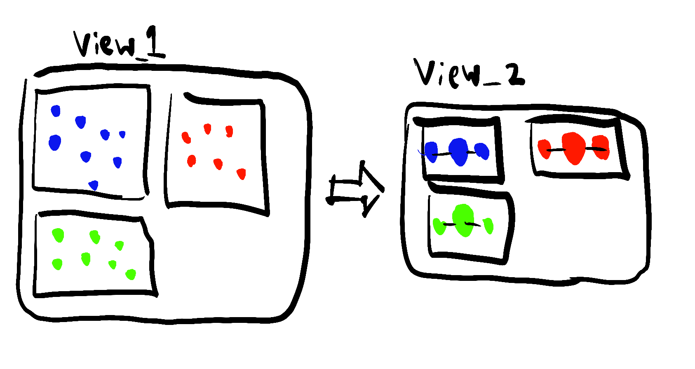
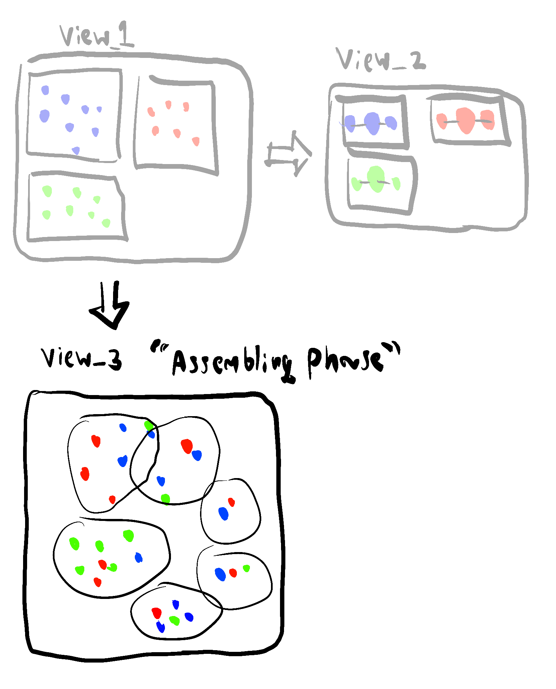
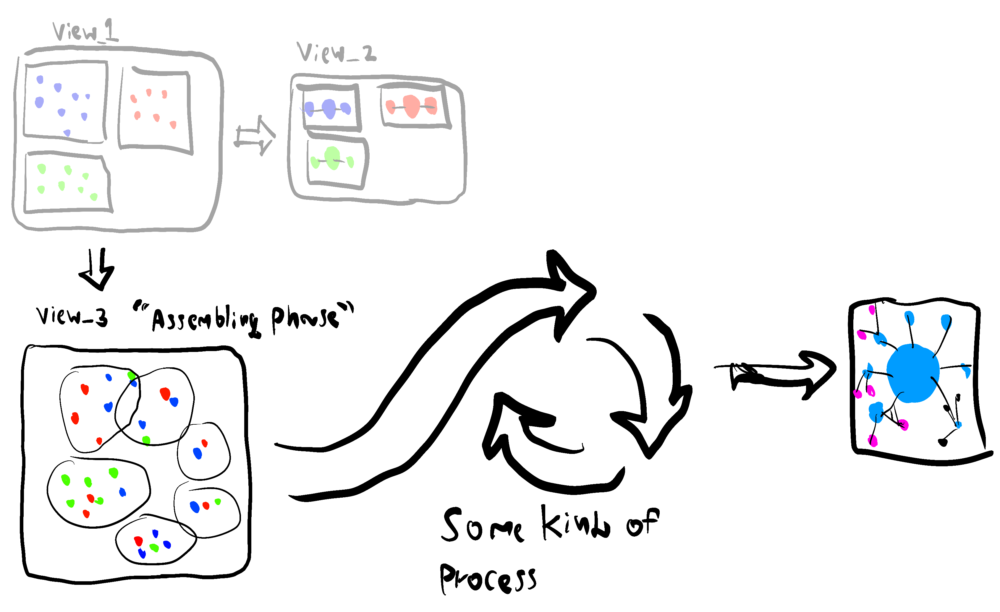
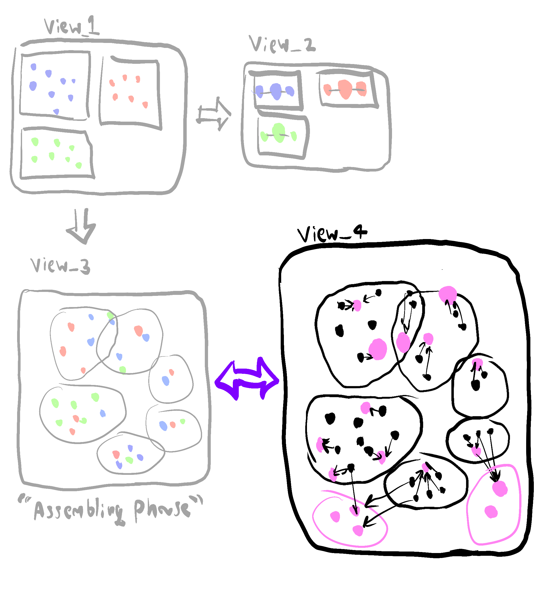
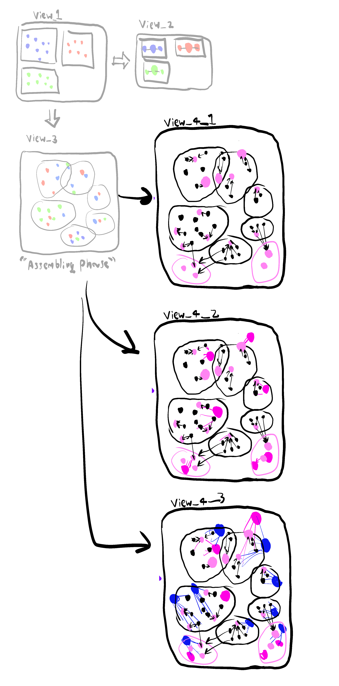
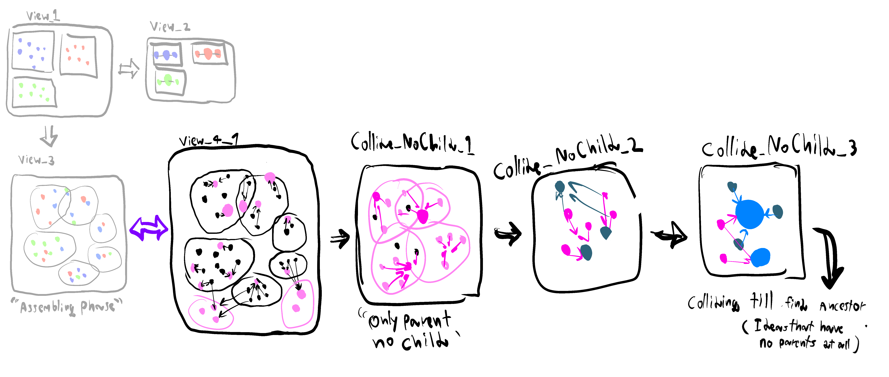
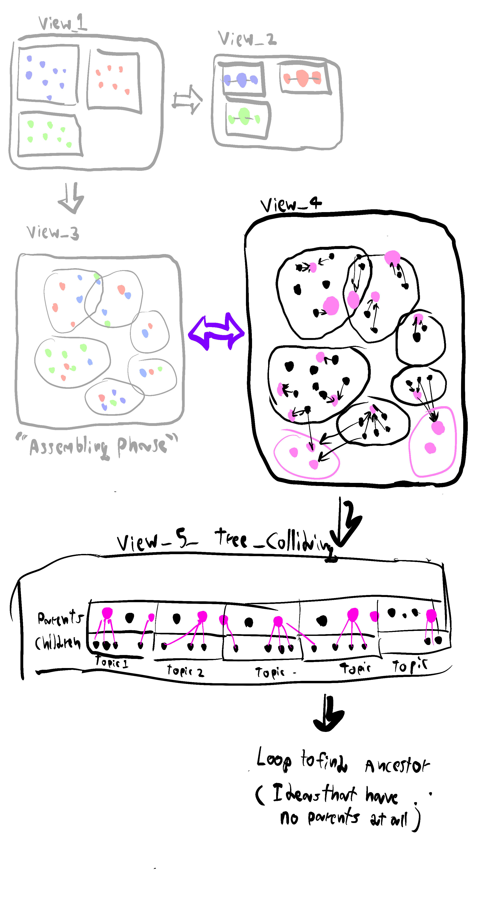

ท้าวความ : หลายอาทิตย์ก่อน (2024-03-12) ในคลาสของวิชา interactive computing  
ก็ได้มีการนำสนอผลของการ brainstorming ในแต่ละ groups      
ซึ่ง groups ของเรา ตอนนี้ไอเดียยังเป็นเอกเทศกันอยู่      
ตอนนั้น ตัวผมใน class เลยลองถามความเห็นของอ. ในเรื่องการทำ step ถัดไปในมุมมองของผมดู     

รูปประกอบการพูดคุยในวันนั้น, 2024-03-12     

จำไม่ค่อยได้แล้วว่าตอนนั้นได้เล่าอะไรให้อ.ฟัง     
แต่อาจารย์ก็ค่อนข้างเห็นด้วย+แนะนำให้ลองเขียนลง blog ดู     

# ปัญหา และสถานการณ์ในปัจจุบัน     

## นิยามศัพท์เฉพาะสำหรับบทความนี้ (ที่ผมมั่วนิ่มขึ้นมาเอง)
**ไอเดีย** = ตัว cards, รูปภาพแสดง idea ใน miro ที่เป็นตัวแทนของ concepts อะไรบางอย่าง     
**มุมมอง** = การเรียงกันของไอเดียในรูปแบบต่างๆ      
**หมายเหตุ**: concept ของ parent and child relation ใน note นี้จะเป็นคนละนิยามกับแบบ traditional  
ใน note นี้หลายๆครั้งจะได้เห็น case ที่ child มีหลาย parents และบางที child ก็สร้าง parent ด้วยซ้ำ (ปรกติเขาไม่ทำกันแบบนั้น ทำแบบ note นี้คือผิดนิยาม)    
ที่ใช้คำนี้ เพราะอยากหยิบยืมนิยามด้านการ converge ไปหาจุดใดจุดหนึ่ง ผสมเป็นไอเดียใหญ่ๆก้อนโตๆ ที่เป็นเหมือน root ของนิยาม traditional  

- สิ่งที่คนแม่น graph theory น่าจะพูดใส่ผม

## State ในปัจจุบัน
ตอนนี้เรามีอยู่ 2 มุมมอง      
มุมมองแรก คือมุมมองที่ไอเดียต่างๆ ถูกจัดกลุ่มตามผู้เสนอ,เจ้าของไอเดีย      
เปรียบเปรยอีกแบบคือ เป็นมุมมองที่เหมือนทุกคนมีจานสีของตัวเอง เตรียมแต้มสี      

มุมมองที่ 2 เป็นเหมือนมุมมอง zoom-out ของมุมมองแรก เป็น exhibitions ของแต่ละคนแบบเป็นเอกเทศ ไว้ใช้นำเสนออาจารย์คาบก่อน       

ถ้าใช้การ analogy ว่าแต่ละคนในกลุ่มเป็นศิลปินที่กำลังจะวาดภาพ     
Final product สุดท้ายที่เมคเซนส์ คือการวาดภาพขึ้นมาให้เป็นรูปเป็นร่างด้วยสี(ไอเดีย)ของทุกคนในกลุ่ม  
    
เป็นภาพ(Exhibition)เดียวแบบโดดๆ     

แต่ก่อนจะถึงขั้นนั้นได้ เราควรจะทำยังไงดี     
โดยที่     
- ไอเดีย-สีในจานสี-card ของแต่ละคนยังโตขึ้นได้เรื่อยๆ ไม่ถูก freeze ไว้      
- ไอเดีย ถูกตัดเล็มทิ้งไปบ้าง แต่ไม่เล็มจนเหี้ยน หรือตัดทิ้งจนไม่เหลือร่องรอยของไอเดียนั้นเลย ถ้าจะทิ้งจริงๆอาจมี transform เปลี่ยนรูปแบบบ้างก็ยังดี      
	- ก่อนหน้านี้ก็มีคนในกลุ่มที่มีความเห็นประมาณนี้เหมือนกัน ที่อยากให้น้ำหนักของไอเดียแต่ละคน กับไม่อยากทิ้งศักยภาพของไอเดียพวกนั้น    ออ
- ถึงไอเดียจะโตขึ้นเรื่อยๆ แต่ก็ converge ไปในทิศทางใดทางหนึ่งให้เราเห็น pattern อะไรบางอย่างของการ synergy ของ idea       

# inspiration  (บ่น)     
 ช่วงเดือนก่อนผมค่อนข้างอินกับ Personal Knowledge Management, Zettelkastern และ [video ของ nick milo](https://youtu.be/WUq8Pun28FI?si=Xuq2jY2yyERBXeZ-) ที่เน้นไปในการจดโน๊ตแบบ button up เอากระดาษมาเรียบเรียง indexing กันภายใต้กฎเกณฑ์บางอย่าง ให้ผสมผสาน เชื่อมโยงกันได้อย่างเป็นธรรมชาติและหลากหลาย และไม่มีกรอบ     

ภาพที่ผมเขียนเพื่อเอาไปเล่าให้อ.ฟังก็เป็น concepts ที่ได้จาก [video นั้น](https://youtu.be/WUq8Pun28FI?si=Xuq2jY2yyERBXeZ-)เหมือนกัน      
พอจะลองนำเสนอแนวทางผ่านการเขียน blog แล้วทั้งที ก็อยากจะลอง refine ปรับปรุงแนวทางที่คิดขึ้นให้ชัดขึ้นหน่อย ด้วยการลองพยายามเขียนแนวทาง, การ represent ความสัมพันธ์ของข้อมูล โดย adapt แนวทางของฝั่ง zettelkastern ให้สุดๆ ดู      

สุดท้ายก็พบว่า พอเป็นการ brainstorm ระดมไอเดียแบบนี้แล้ว การสร้างกฎเกณฑ์, modeling language เลียนแบบ zettelkastern บนหน้า canvas 2d โล่งๆ มัน overkill, ยุ่งยาก, วุ่นวายเกินไป (ถ้าไม่ใช้ software เฉพาะ)     

เลยต้องหาแนวทางใหม่ ที่เอา concepts บางส่วนของ zettelkastern มาใช้ได้ง่าย ๆ       

# ข้อเสนอแนะ    

## 1. assembling phase 
สร้าง assembling phase  ของ ideas ขึ้นมาเป็นมุมมองที่ 3     
เอาไอเดีย(สี)จากมุมมอง 1(จานสีของแต่ละคน) ไปวาง      
อันไหนที่คล้ายๆกันก็วางไว้ใกล้ๆ     
ทีนี้มันก็จะเกิดเป็นโครงสร้างใหม่ขึ้นมา     
เป็นกระบวนการแบบ bottom-up (โครงสร้างใหญ่ๆ ประกอบขึ้นจากโครงสร้างเล็กๆ)      

เพื่อให้ดูได้เข้าใจง่าย บางทีอาจสร้างกรอบ หรือเซ็ต คลุมไอเดียไว้     

อย่าง mental health, game, adventure, self-explore, sub-culture, ปัญหาสังคม, ค่านิยม etc.     

Problem: ไอเดียบางอย่างเข้าพวกได้หลาย set แล้วถ้าจะเอา sets หลายๆตัวคลุมไอเดียนั้น มันจะเริ่มดูมั่ว   
Solution: ใช้ shadow clones jutsu แยกร่างไอเดียนั้นแทน         

พอเอา ideas ของทุกคนมากองๆกันแล้ว ก็ถือว่าเสร็จในขั้นแรก      
แล้วอาจ backup ตัว phase ของไอเดียในตอนนี้เก็บไว้ เผื่อขั้นตอนต่อไปไม่เวิร์ค อยากย้อนกลับไปทำใหม่           
หรืออยากเห็นโครงสร้าง เค้าเดิมของไอเดียทั้งหลายที่รวบรวมกันมาตอนอาทิตย์ก่อนๆ       

## 2. Colliding phase

สร้าง colliding phase ของ idea ขึ้นมาเป็นมุมมองแบบที่ 4    
เริ่มจาก copy มุมมองแบบที่ 3 มา     
แล้วเราจะเอาไอเดียที่อยู่ใกล้ๆ มาลองบีบ (squeeze) ผสม เชื่อมโยง ให้แตกหน่อออกมา    
เหมือนผสมสี     
ถ้ามีไอเดียใหม่เกิดจากไอเดียเก่า ก็อาจโยงระหว่างไอเดียเก่า,ใหม่ด้วยลูกศร     
ซึ่งลูกศรที่ว่า คิดว่าน่าจะแทนที่ความหมายพวกนี้ อย่างใดอย่างหนึ่ง     
A--> C <— B :       
- A,Bจุดร่วมเดียวกันคือ C     
- A+ B ผสมแล้วเกิดเป็นไอเดียใหม่คือ C    
A —> C:      
- A เกิดเป็นไอเดียใหม่คือ C   
- A transform เป็น C 

ในขั้นตอนนี้ถ้าปิ๊งไอเดียใหม่ ก็ใส่ไอเดียนั้นลงไปได้เต็มที่ ให้จำนวนไอเดียโตขึ้นเรื่อย ๆ     
ถึงชื่อจะบอกว่าเน้น colliding แต่ถ้า fixed ไม่ให้เพิ่มไอเดีย brand new เลย ก็อาจไม่เวิร์ค      

## แล้วเราจะไปถึง state สุดท้าย ที่ได้เป็น exhibition เดียวโดด ๆ ได้ยังไง

ยังคิดไม่ออก       
วิธีนึงที่ทำกันทั่วไปคือ Colliding แบบที่เหลือแต่ไอเดียใหม่ไปเรื่อยๆ พร้อมกับตัดไอเดียเก่า ที่ collide   เรียบร้อยทิ้ง แต่ไม่รู้ว่าในทางปฎิบัติ จะมีไอเดียส่วนไหนที่ถูกจำกัดโดยที่ไม่ตั้งใจไหม   
หรือควรจะทำลูปอะไรบางอย่าง  

ส่วนตัวเลยคิดว่าทำ assembling phase กับลอง colliding phase ขั้นต้นแบบที่ยังไม่ตัดไอเดียไหนทิ้งไปเลยก่อน คงเห็นภาพรวมและแนวทางว่าควรทำอะไรต่อไปได้ชัดขึ้น ยังไงถ้าไม่เวิร์คขึ้นมาก็ backtrack กลับมามุมมองก่อนหน้าได้อยู่แล้ว 

 

 
